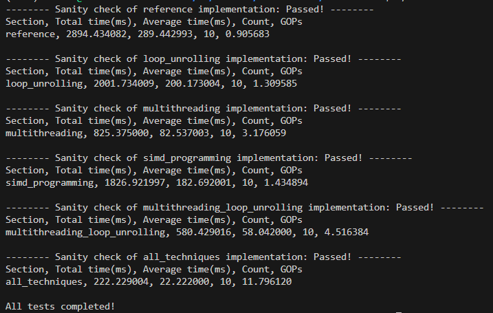
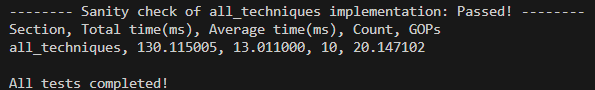
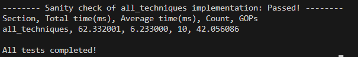
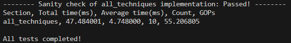

# TinyChat: Optimizing LLM on Edge Devices

My solution with code comments of lab5 for [MIT-6.5940 efficientml.ai course](https://efficientml.ai/).

Here is [tutorial document](https://docs.google.com/document/d/13IaTfPKjp0KiSBEhPdX9IxgXMIAZfiFjor37OWQJhMM/edit?usp=sharing).

The implementations needed to be completed in this lab include:
1. Loop Unrolling ✔
2. Multithreading ✔
3. SIMD Programming ✔
4. Multithreading with Loop Unrolling ✔
5. Combination of All Techniques ✔

## Results
```transformer/tests/test_linear.cc: const int m = 1, n = 32000, k = 4096;```

- num_thread = 8



- num_thread = 16



- num_thread = 32



- num_thread = 64



## Related Projects

[TinyChatEngine](https://github.com/mit-han-lab/TinyChatEngine).

[TinyEngine](https://github.com/mit-han-lab/tinyengine).

[Smoothquant](https://github.com/mit-han-lab/smoothquant).

[AWQ: Activation-aware Weight Quantization for LLM Compression and Acceleration](https://github.com/mit-han-lab/llm-awq)

## Acknowledgement

[llama.cpp](https://github.com/ggerganov/llama.cpp)

[transformers](https://github.com/huggingface/transformers)

[LLaMA2-7B-on-laptop by yifanlu](https://github.com/yifanlu0227/LLaMA2-7B-on-laptop/tree/aaf7bf3e7f9667d4c6170b2c3ffff39b31c089e3)